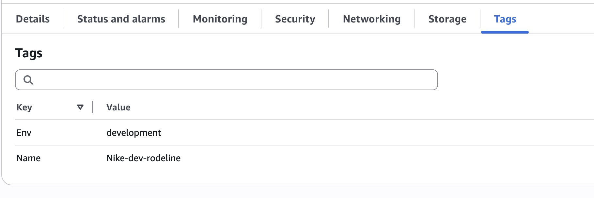

# Cloud Security with AWS IAM (Nike Scenario)

## Overview
In this project, I worked through a scenario where I joined Nike as a DevOps engineer and had to securely onboard a new intern into the team’s AWS environment. I launched EC2 instances for production and development, then used AWS Identity and Access Management (IAM) to control which resources the intern could access. This project focused on real-world access control, least privilege, and tag-based permissions.

---

## Scenario: Joining Nike as a DevOps Engineer
Nike is preparing for increased traffic during the holiday season and needs:
- More computing power for their applications
- A secure way to onboard a new intern without risking production resources

My responsibilities in this project were to:
- Launch EC2 instances for production and development
- Create IAM policies that protect production
- Give the intern controlled access to only the development environment
- Test and validate the permissions

---

## What I Built

### 1. Launched EC2 Instances
- Created two EC2 instances:
  - **Production instance** (`Env = production`)
  - **Development instance** (`Env = development`)
- Used tags to organize and control access to each instance.

### 2. Created a Custom IAM Policy
- Allowed the intern to:
  - Start, stop, and describe **only** EC2 instances tagged `Env = development`
- Explicitly denied:
  - Creating tags  
  - Deleting tags  
- Added a tag-based condition to restrict actions to the development environment.

### 3. Set Up an AWS Account Alias
- Created a custom alias to simplify login:
  - `nike-alias-yvebz01`

### 4. Created IAM Users & User Groups
- Created a user group for Nike interns.
- Attached the custom IAM policy to the group.
- Created a new IAM user (`nike-dev-rodeline`) and added them to the group.
- Shared login credentials using the secure AWS-generated CSV file.

### 5. Tested IAM Permissions
- Logged in as the intern to verify access:
  - **Denied**: stopping the production instance  
  - **Allowed**: stopping the development instance  
- Confirmed the policy worked exactly as intended.

### 6. Used the IAM Policy Simulator
- Simulated actions like `StopInstances` and `DeleteTags`
- Verified that:
  - Tag-restricted actions were allowed only for development resources  
  - All tag-modifying actions were denied  

---

## Key Concepts Learned
- IAM Policies (Effect, Action, Resource, Condition)
- Resource-level permissions using tags
- IAM Users, Groups, and permission inheritance
- EC2 instance management
- AWS Account Alias configuration
- IAM Policy Simulator for safe testing
- Principle of Least Privilege (PoLP)

---

## Challenges
The most challenging part was understanding how IAM evaluates permissions when combining:
- Allow statements  
- Deny statements  
- Tag-based conditions  

Testing with the IAM Policy Simulator helped clarify how AWS processes permissions.

---

## Looking Ahead
Next, I plan to continue learning:
- IAM best practices  
- VPC networking  
- Cloud security fundamentals  
- Role-based access control (RBAC)  
- AWS monitoring tools like CloudTrail and GuardDuty  

---

## 📸 Screenshots

Below are the screenshots documenting each step of the AWS IAM + EC2 Nike scenario project.

---

### **1. EC2 Instance Tags (Development Instance)**

### **2. EC2 Instance Tags (Production Instance)**

---

### **3. AMI Selection for EC2 Instance**

---

### **4. IAM Policy Details (Review & Create)**

---

### **5. AWS Account Alias Creation**

---

### **6. Creating IAM User Group (nike-dev-group)**

### **7. User Group Successfully Created**

---

### **8. Creating IAM User (nike-dev-rodeline)**

### **9. IAM User Review & Create**

### **10. IAM User Created Successfully**

---

### **11. Access Denied on Production Instance**

---

### **12. Successfully Stopped Development Instance**

---

### **13. IAM Policy Simulator — Initial State**

### **14. IAM Policy Simulator — Denied Results**

---

### **15. IAM User Limited Access (Service Catalog Denied)**

